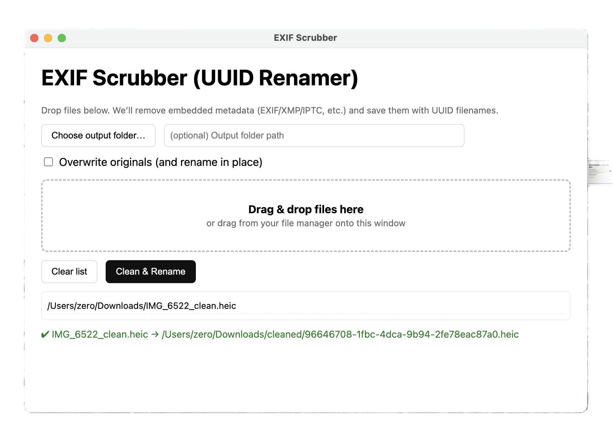

# EXIF Remover

This is a desktop app to help me remove EXIF data from photos on my desktop

## To test the desktop app
```bash
chmod a+x run.sh
./run.sh
```

## To generate the desktop app
```bash
chmod a+x build.sh
./build.sh
```

This creates a ```dist/``` folder that will includes the installable for different platforms.

## This is how it looks on MacOS

<p align="left">
  
</p>
